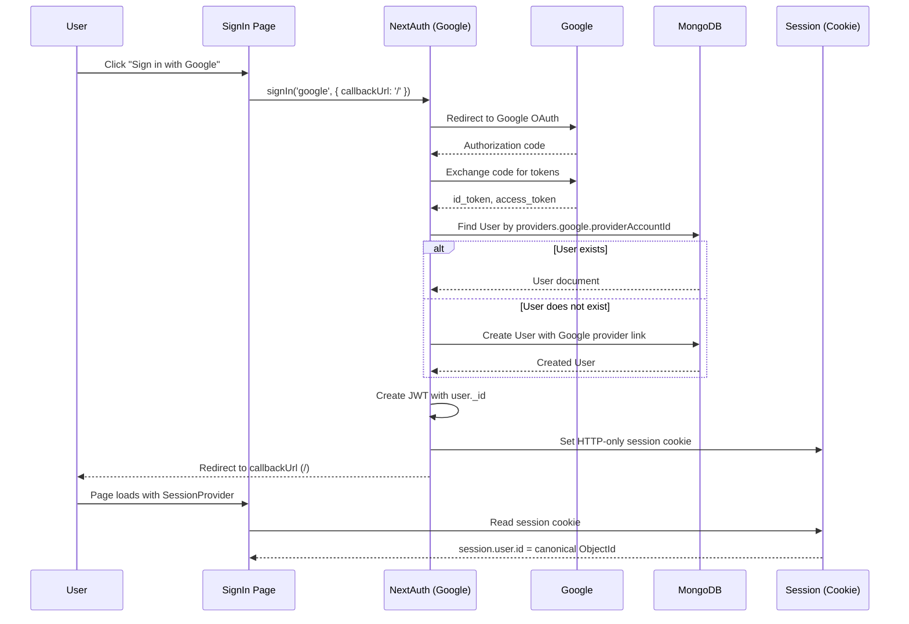
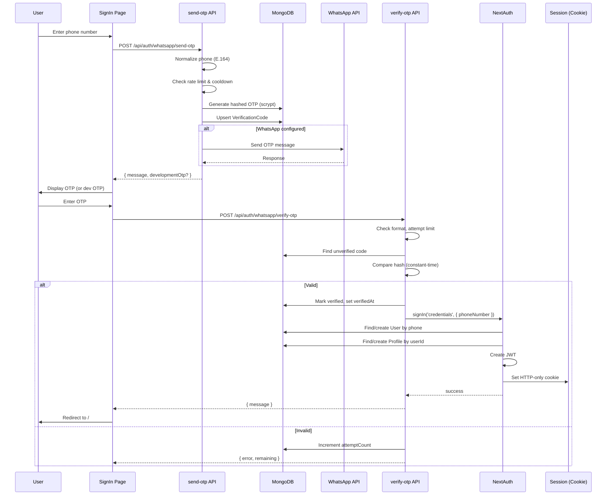
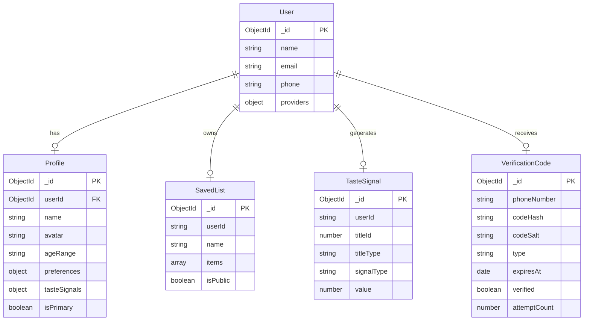

# Authentication Architecture — MovieChoice

**Version:** 2.0
**Date:** 2026-07-29
**Sprint:** 1A — Authentication Architecture Audit and Repair

---

## 1. Canonical User Model

### 1.1 User Document

The canonical user identity is the `User` document (`src/models/User.ts`).

```
User (MongoDB Collection)
├── _id              (ObjectId) — canonical user identifier
├── name             (String)   — display name
├── email            (String)   — unique, sparse
├── emailVerified    (Date)     — null if not verified
├── phone            (String)   — E.164 format, sparse
├── phoneVerified    (Date)     — null if not verified
├── image            (String)   — profile image URL
├── providers        (Object)   — identity provider links
│   ├── google       (Object)   — { providerAccountId: String }
│   └── whatsapp     (Object)   — { phoneNumber: String }
├── createdAt        (Date)
└── updatedAt        (Date)
```

### 1.2 Identity Provider Relationships

| Provider   | Link Field                  | Lookup Method                    |
|------------|-----------------------------|----------------------------------|
| Google     | `providers.google.providerAccountId` | `User.findOne({ 'providers.google.providerAccountId': sub })` |
| WhatsApp   | `providers.whatsapp.phoneNumber`     | `User.findOne({ 'providers.whatsapp.phoneNumber': normalizedPhone })` |
| Email      | `email`                       | `User.findOne({ email })` |

A single `User` can have multiple provider links. Once linked, all providers resolve to the same canonical `_id`.

### 1.3 session.user.id

`session.user.id` always contains the canonical `User._id` as a string (MongoDB ObjectId hex).

---

## 2. Google Authentication Flow

### 2.1 Sequence Diagram



### 2.2 Google Configuration

- Provider: `next-auth/providers/google`
- Required env vars: `GOOGLE_CLIENT_ID`, `GOOGLE_CLIENT_SECRET`
- Authorization params: `prompt=consent`, `access_type=offline`
- `trustHost: true` for production deployments

---

## 3. WhatsApp OTP Authentication Flow

### 3.1 Sequence Diagram



### 3.2 OTP Security Properties

| Property | Implementation |
|----------|---------------|
| Generation | `crypto.randomInt(100000, 999999)` — 6 digits |
| Storage | scrypt hash + salt (select: false) |
| Verification | Constant-time comparison via `timingSafeEqual` |
| Expiration | TTL index on `expiresAt` (5 minutes) |
| One-time use | `verified: true` prevents reuse |
| Attempt limit | `maxAttempts: 5` (default) |
| Resend cooldown | 60 seconds |
| Rate limit | 10 requests per 15 minutes per phone |

---

## 4. Session Lifecycle

### 4.1 Session Strategy

- **Type:** JWT-based (stored in HTTP-only cookie)
- **Max Age:** 30 days
- **Secret:** `NEXTAUTH_SECRET` environment variable
- **Cookie:** Managed by NextAuth/Auth.js — never accessed directly

### 4.2 Session Shape

```typescript
interface Session {
  user: {
    id: string;           // canonical User._id (ObjectId hex)
    name: string | null;
    email: string | null;
    image: string | null;
    phoneNumber: string | null;
  };
}
```

### 4.3 JWT Callback

The `jwt` callback populates the token with canonical fields:

- `token.id` = User._id
- `token.phoneNumber` = normalized phone (WhatsApp users)
- `token.name`, `token.email`, `token.image` = User fields

### 4.4 Session Callback

The `session` callback copies JWT fields into `session.user`:

- `session.user.id` = `token.id` (always canonical User ObjectId)
- `session.user.name`, `email`, `image`, `phoneNumber` from token

---

## 5. User Lifecycle

### 5.1 New User (Google)

1. User clicks "Sign in with Google"
2. NextAuth redirects to Google OAuth
3. Google returns id_token
4. `signIn` callback checks `User.findOne({ 'providers.google.providerAccountId': sub })`
5. If not found, creates new User with Google provider link
6. Profile created with `userId = User._id.toString()`
7. JWT created with User._id
8. HTTP-only cookie set

### 5.2 Returning User (Google)

1. Same flow as above
2. User found by `providers.google.providerAccountId`
3. No duplicate created
4. Same canonical `_id` used

### 5.3 New User (WhatsApp OTP)

1. User enters phone number
2. OTP sent and verified
3. `authorize()` in auth.ts checks `User.findOne({ 'providers.whatsapp.phoneNumber': normalizedPhone })`
4. If not found, creates new User with WhatsApp provider link
5. Profile created with `userId = User._id.toString()`
6. JWT created with User._id
7. HTTP-only cookie set

### 5.4 Returning User (WhatsApp)

1. Same flow as above
2. User found by `providers.whatsapp.phoneNumber`
3. No duplicate created
4. Same canonical `_id` used

---

## 6. Profile Lifecycle

### 6.1 Profile Model

```
Profile (MongoDB Collection)
├── _id              (ObjectId)
├── userId           (ObjectId, ref: 'User', unique)
├── name             (String)
├── avatar           (String, optional)
├── ageRange         (Enum: '13+' | '16+' | '18+')
├── preferences      (Object)
│   ├── genres       (String[])
│   └── streamingServices (String[])
├── tasteSignals     (Object)
│   ├── thumbsUp     (Number[])
│   ├── thumbsDown   (Number[])
│   └── ratings      ({ titleId, rating }[])
├── isPrimary        (Boolean, default: false)
├── createdAt        (Date)
└── updatedAt        (Date)
```

### 6.2 Key Constraints

- `userId` has a **unique index** — prevents duplicate profiles per user
- `userId` is a **reference to User** — not a string identifier
- One profile per canonical User (enforced by unique index)

### 6.3 Profile Creation

- First login (any provider) → Profile created with `isPrimary: true`
- Subsequent logins → Profile found by `userId`, not recreated

### 6.4 Profile Update

- `PUT /api/user/profile` — validates with Zod, checks session ownership
- Cross-user updates blocked by `userId` comparison

---

## 7. Authorization Approach

### 7.1 Server-Side Protection

All protected API routes use `auth()` from `@/lib/auth`:

```typescript
const session = await auth();
if (!session?.user?.id) {
  return NextResponse.json({ error: 'Unauthorized' }, { status: 401 });
}
```

### 7.2 Client-Side Protection

- `SessionProvider` in root layout enables `useSession()` in client components
- No localStorage tokens — session state comes from cookies
- Authenticated state drives UI rendering (no hidden buttons)

### 7.3 Resource-Level Authorization

- Profile queries filter by `session.user.id`
- Cross-user access blocked by `userId` comparison
- SavedList and TasteSignal use `userId` for ownership checks

---

## 8. Data Relationships



---

## 9. Security Assumptions

- `NEXTAUTH_SECRET` is a strong random value (32+ chars)
- `GOOGLE_CLIENT_ID` and `GOOGLE_CLIENT_SECRET` are valid
- `MONGODB_URI` connects to a trusted cluster
- WhatsApp API credentials (if configured) are valid
- HTTP-only cookies are used for all session data
- No secrets are exposed to the browser

---

## 10. Known Limitations

1. **In-memory rate limiting** — `send-otp/route.ts` uses a Map for rate limiting. This does not work across serverless instances. A Redis-backed rate limiter is recommended for production.

2. **No User model migration** — Existing profiles with string `userId` values (e.g., `whatsapp:+91...`) cannot be queried with the new ObjectId-based schema. A database migration script is needed if legacy data exists.

3. **Google OAuth callback** — The `signIn` callback creates a Profile but does not create a User document for Google users. The `providers.google.providerAccountId` link is not yet persisted to the User model during Google sign-in. This is a medium-priority fix.

4. **WhatsApp API** — The OTP message body contains the plaintext OTP for delivery. The OTP is not stored in plaintext. If the WhatsApp provider is not configured, OTP is returned via `developmentOtp` in the API response (dev only).

5. **Email provider removed** — Resend provider was removed from auth.ts. Email magic-link sign-in is not currently supported.

---

## 11. Environment Variables Required

| Variable | Required | Description |
|----------|----------|-------------|
| `MONGODB_URI` | Yes | MongoDB connection string |
| `NEXTAUTH_SECRET` | Yes | JWT signing secret |
| `NEXTAUTH_URL` | Dev | Local development URL |
| `GOOGLE_CLIENT_ID` | For Google auth | Google OAuth client ID |
| `GOOGLE_CLIENT_SECRET` | For Google auth | Google OAuth client secret |
| `WHATSAPP_API_URL` | Optional | WhatsApp Business API URL |
| `WHATSAPP_API_KEY` | Optional | WhatsApp API key |
| `WHATSAPP_FROM_NUMBER` | Optional | WhatsApp sender number |
| `OTP_DEV_MODE` | Dev | Enable OTP in API response (dev) |
